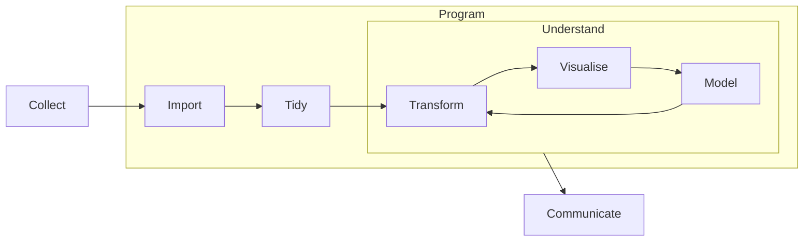

---
{"dg-publish":true,"permalink":"/edav/","tags":"gardenEntry","dgHomeLink":true,"dgPassFrontmatter":false,"dgShowBacklinks":false,"dgShowLocalGraph":false}
---

> [!meta]-  
state:: [[%wip|%wip]]  
sup:: [[Columbia|Columbia]]  

# EDAV

> Visualization is a fundamentally human activity.

- Interdisciplinary
    - [[Statistics|Statistics]]
    - [[Computer Science|Computer Science]]
    - Graphic Design
    - Journalism
    - Subject Expertise
    - Psychology

- Fundamental problem
    - Exploration vs. Visualization
    - Exploratory vs. Explanatory
    - Not mutually exclusive
    - Visualizations offer insight are likely to be shared

## Logistics

* Aims
    * look for patterns
    * identify outliers
    * make comparisons
    * discover clusters
* Textbook
    * *Graphical Data Analysis with R*
* Website
    * <https://edav.info>
* Requirements
    * Problems sets (5)
    * Midterm & Final
    * Community contribution
    * Final project
* Tools
    * [[R|R]]
    * [[JavaScript|JavaScript]]
    * D3 (library for JS)
* Grade
    - 35% Final Project
    * 25% Problem Sets
    - 25% Final Exam
    - 10% Community Contribution
        - give a well-rehearsed 5 minute lightning talk in class (live or video) on a datavis topic (theory or tool) • create a cheatsheet or other resource
        - write a tutorial for a tool that's not well documented
        - build a viz product (ex. htmlwidget) for class use
        - create a web site for sharing class resources publicly
        - organize and a lead a help session on a topic you've mastered • other...
    - 5% Peer Review of Final Projects
- Remarks
    - NO Piechart

## Notes

### 2022-09-08

- [[EDAV - Continuous Variable|EDAV - Continuous Variable]]
- [[Histogram|Histogram]]
- [[ggplot2|ggplot2]]

### 2022-09-13

- [[Boxplot|Boxplot]]
- [ ] Density curves are the composition of multiple normal distributions.
    - Choose the *right* bandwidth that makes the curve not too smooth or not too sharp
- [ ] [[Ridgeline|Ridgeline]] lec-note 4

### 2022-09-15

- [[Q-Q Plot|Q-Q Plot]]

### 2022-09-20

- [ ] [[EDAV - Categorical Data|EDAV - Categorical Data]]
    - Use [[ggplot2#Facet|facets]] w/ different scales if needed to
        - Usually, we should not use different scales in a plot
        - [[ggplot2#^32e6e9|ggplot2#^32e6e9]]
    - Watch the top/bottom-coded data
        - "or more" category may contain too much data to be considered "or more"
    - When you just present a proportion of the data, put a **smart cut**
        - For example, when two bars are similar, it's not reasonable to cut them; you should look for a "jump" instead
- [[Bar Chart|Bar Chart]]
- [[Cleveland Dot Plot|Cleveland Dot Plot]]
- [[forcats|forcats]]
- [[dplyr#summarise()|dplyr#summarise()]]

### 2022-09-22

- [[forcats#Lumping|forcats#Lumping]]
- [ ] [[EDAV - Dependency Relationship|EDAV - Dependency Relationship]]
- [[Scatterplot|Scatterplot]]
- [[R Package - Plotly|R Package - Plotly]]
- [[Heatmap|Heatmap]]
- [[Density Contour Plot|Density Contour Plot]]

### 2022-09-27

- [[Scatterplot Matrix|Scatterplot Matrix]]
- [[tidyr|tidyr]]
- [[ggplot2#Facet|ggplot2#Facet]]
- Combining [[EDAV - Continuous Variable|Continuous Variable]]s + [[EDAV - Categorical Data|Categorical Variable]]s
    - mapping options:
        - Continuous: x-axis, y-axis, color (not so great), size (not so great)
        - Categorical: color, facets (rows, columns), shape (maybe)
    - Add one variable at a time
    - Create more graphs if suitable options run out
    - Switch options to test

### 2022-09-29

- [ ] [[EDAV - Multivariate Continuous Data|EDAV - Multivariate Continuous Data]]
    - Remember to transform values into numerics (continuous)
- [[Parallel Coordinate|Parallel Coordinate]]
- [ ] [[EDAV - Multivariate Categorical Data|EDAV - Multivariate Categorical Data]]

### 2022-10-06

- [[Mosaic Plot|Mosaic Plot]]

### 2022-10-11

- Getting Data
    - Considerations for deciding how to get data
        - Reproducibility of workflow
        - Frequency with which data is updated
        - Available formats
        - Time to process data
    - Methods
        - Dedicated [[R Package|R Package]]s, for example, `atus`
        - APIs with `httr` package
        - Web scraping
            - is the last resort
            - ❌ NOT to do
                - Against the law
            - ✅ Should do
                - think and investigate legal issues
                - think about ethical questions
                - limit bandwidth use
                - scrape only what you need
    - [[rvest|rvest]]
- [[Mosaic Plot#Simpson's Paradox|Mosaic Plot#Simpson's Paradox]]
- [[EDAV - Categorical Data|EDAV - Categorical Data]]

### 2022-10-13

- PS2
    - Use `fct_relevel` or `fct_reorder`
    - The bar is horizontal
    - for 2, only one column is needed
    - provide links for the research
    - patterns should involve all variables
    - find the best options for each pair of vars
- [[Heatmap|Heatmap]]
- [[Alluvial Diagram|Alluvial Diagram]]
