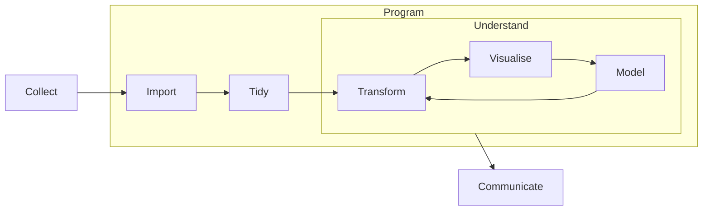

---
{"dg-publish":true,"permalink":"/edav/"}
---

> [!meta]-  
state:: [[%wip\|%wip]]  
sup:: [[Columbia\|Columbia]]  
sub:: [[edav-garden\|edav-garden]], [[edav-output-1\|edav-output-1]]  

# EDAV

> Visualization is a fundamentally human activity.

- Interdisciplinary
    - [[Statistics\|Statistics]]
    - [[Computer Science\|Computer Science]]
    - Graphic Design
    - Journalism
    - Subject Expertise
    - Psychology

- Fundamental problem
    - Exploration vs. Visualization
    - Exploratory vs. Explanatory
    - Not mutually exclusive
    - Visualizations offering insight are likely to be shared

## Logistics

- Aims
    - look for patterns
    - identify outliers
    - make comparisons
    - discover clusters
- Textbook
    - *Graphical Data Analysis with R*
- Website
    - <https://edav.info>
- Requirements
    - Problems sets (5)
    - Midterm & Final
    - Community contribution
    - Final project
- Tools
    - [[R\|R]]
    - [[JavaScript\|JavaScript]]
    - [[D3\|D3]] (library for [[JavaScript\|JS]])
- Grade
    - 35% Final Project
    - 25% Problem Sets
    - 25% Final Exam
    - 10% Community Contribution
        - give a well-rehearsed 5 minute lightning talk in class (live or video) on a datavis topic (theory or tool) • create a cheatsheet or other resource
        - write a tutorial for a tool that's not well documented
        - build a viz product (ex. htmlwidget) for class use
        - create a web site for sharing class resources publicly
        - organize and a lead a help session on a topic you've mastered • other...
    - 5% Peer Review of Final Projects
- Remarks
    - NO Piechart

## Notes

### 2022-09-08

- [[EDAV - Continuous Variable\|EDAV - Continuous Variable]]
- [[Histogram\|Histogram]]
- [[ggplot2\|ggplot2]]

### 2022-09-13

- [[Boxplot\|Boxplot]]
- [[Density Curve\|Density Curve]]
- [[Ridgeline\|Ridgeline]]

### 2022-09-15

- [[Q-Q Plot\|Q-Q Plot]]

### 2022-09-20

- [[EDAV - Categorical Data\|EDAV - Categorical Data]]
    - [[Bar Chart\|Bar Chart]]
    - [[Cleveland Dot Plot\|Cleveland Dot Plot]]
- [[forcats\|forcats]]
- [[dplyr#summarise()\|dplyr#summarise()]]

### 2022-09-22

- [[forcats#Lumping\|forcats#Lumping]]
- [[EDAV - Dependency Relationship\|EDAV - Dependency Relationship]]
    - [[Scatterplot\|Scatterplot]]
    - [[Heatmap\|Heatmap]]
    - [[Density Contour Plot\|Density Contour Plot]]
- [[R Package - Plotly\|R Package - Plotly]]

### 2022-09-27

- [[Scatterplot Matrix\|Scatterplot Matrix]]
- [[tidyr\|tidyr]]
- [[ggplot2#Facet\|ggplot2#Facet]]
- [[EDAV - Categorical Data#Combine Continuous Variables and Categorical Variables\|EDAV - Categorical Data#Combine Continuous Variables and Categorical Variables]]

### 2022-09-29

- [[EDAV - Multivariate Continuous Data\|EDAV - Multivariate Continuous Data]]
    - [[Parallel Coordinate\|Parallel Coordinate]]
- [[EDAV - Multivariate Categorical Data\|EDAV - Multivariate Categorical Data]]

### 2022-10-06

- [[Mosaic Plot\|Mosaic Plot]]

### 2022-10-11

- Getting Data
    - Considerations for deciding how to get data
        - Reproducibility of workflow
        - Frequency with which data is updated
        - Available formats
        - Time to process data
    - Methods
        - Dedicated [[R Package\|R Package]]s, for example, `atus`
        - APIs with `httr` package
        - Web scraping
            - is the last resort
            - ❌ NOT to do
                - Against the law
            - ✅ Should do
                - think and investigate legal issues
                - think about ethical questions
                - limit bandwidth use
                - scrape only what you need
    - [[rvest\|rvest]]
- [[Mosaic Plot#Simpson's Paradox\|Mosaic Plot#Simpson's Paradox]]
- [[EDAV - Categorical Data\|EDAV - Categorical Data]]

### 2022-10-13

- [[Heatmap\|Heatmap]]
- [[Alluvial Diagram\|Alluvial Diagram]]

### 2022-10-18

- [[R Package - Bookdown\|R Package - Bookdown]]
    - [Home | Bookdown](https://bookdown.org)
- [[Git\|Git]]/GitHub Tutorials
    - [3 Contribute to this Resource | edav dot info, 1st edition](https://jtr13.github.io/EDAV/contribute.html)
    - [Chapter 6 GitHub/git Resources | edav.info, 2nd edition](https://edav.info/github.html)
    - [Let’s Git started | Happy Git and GitHub for the useR](https://happygitwithr.com)
- [RStudio Projects](https://r4ds.had.co.nz/workflow-projects.html)

### 2022-10-20

- A template in GitHub is a repo without history when you fork

### 2022-10-25

- [[Biplot\|Biplot]]

### 2022-10-27

- Choose Data
    - No Kaggle data
        - go to the direct source
    - No popular data
        - e.g. Yelp, Airbnb
    - *Healthy* data
        - no wrong data
    - *good-shape* data
        - balance between the number of observations and variables
- [[Graph Color\|Graph Color]]

### 2022-11-01

- For later parts, you do not need to strictly follow the proposal
- [[Graph Color#General Tips\|Graph Color#General Tips]]
- [[EDAV - Time Series\|EDAV - Time Series]]

### 2022-11-03

- [[R Type - Date\|R Type - Date]]
- [[lubridate\|lubridate]]
- [[EDAV - Missing Data\|EDAV - Missing Data]]

### 2022-11-10

- [[Spatial Data\|Spatial Data]]
- [[Choropleth\|Choropleth]]
- [[Geographic Coordinate\|Geographic Coordinate]]

### 2022-11-15

- [[D3\|D3]]
- [[HTML\|HTML]] intro
    - [[DOM\|DOM]]
- [[CSS\|CSS]] intro
- [[SVG\|SVG]]
    - SVGs, Scalable Vector Graphics, is an [[XML\|XML]]-based vector image format for defining two-dimensional graphics, having support for interactivity and animation.
- [[JavaScript\|JavaScript]] Intro
    - Be generally familiar with arrays, objects, functions
    - Be aware that ES6 does things differently
    - [[JS Array Function\|JS Array Function]]
- [[Developer Tools\|Developer Tools]]

### 2022-11-17

- [[D3\|D3]]
- [[JS Array Function\|JS Array Function]]

### 2022-11-29

- [[D3 Bind Data\|D3 Bind Data]]
- [[D3 Scale\|D3 Scale]]
- [[D3 Margin\|D3 Margin]]

### 2022-12-01

- Final project tips
    - The most important part: the result
    - Do not use other libraries when using [[D3\|D3]]
    - Use raw [[HTML\|HTML]] in RMarkdown like it is in the `<body>` section
- Share D3 Online
    - [~] there are advantages to an online setup, for example, not having to set up a local server as described in the chapter on reading files.
    - [VizHub](https://vizhub.com/): host [[D3\|D3]] visualizations online
    - [[R Package - Bookdown\|Bookdown]]: include D3 code directly in a bookdown book hosted online
        - [+] everyone is in one document
        - [-] the book must be knit to view the HTML which happens quickly without R code but is still an extra step
        - Workflows
            - Include everything in the `Rmd` files using raw [[HTML\|HTML]] code
            - Put [[D3\|D3]] code in a separate `js` file, and then include it using `<script>` tag
                - remember to include the link to the [[D3\|D3]] library first
                - you can then create an identical `html` file for testing purposes only rather than render the full bookdown book each time you would like to observe changes to your D3 code
            - Put the entire visualization ([[HTML\|HTML]] and [[D3\|D3]] code) in a separate `html` file, and then include it using `<iframe>` tag
    - [Observable](https://observablehq.com): official D3 web tool for creating and sharing D3 code
- [[D3 Axes\|D3 Axes]]
- [[JS Type - Array\|JS Type - Array]]
- [[JS Function - map\|JS Function - map]]
- [[D3 Functions\|D3 Functions]]
- [[D3 Interactivity\|D3 Interactivity]]
- [[D3 Transition\|D3 Transition]]
