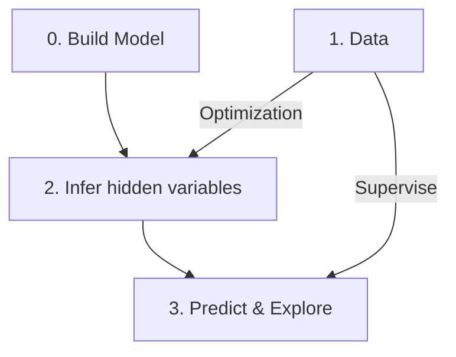

---
{"dg-publish":true,"permalink":"/machine-learning/","title":"Machine Learning","created":"2021-07-25T23:36:31","updated":"2023-04-25T19:05:00"}
---

# Machine Learning

## Definition

Machine Learning
: A computer program is said to learn from experience $E$ with respect to some class of tasks $T$ and performance measure $P$, if its performance at tasks in $T$, as measured by $P$, improves with experience $E$
- [r] Michell, *Machine Learning* 1997

- From a scientific and philosophical point of view,  machine learning is interesting because developing our understanding of machine learning entails developing our understanding of the **principles that underlie intelligence**

### Task *T*

ML tasks are usually described in terms of how the ML system should **process an ==example==**.

An example is a collection of **==features==** that have been **quantitatively measured** from some object or event that we want the ML system to process. We typically represent an example as a vector $x ∈ \mathbb{R}^n$ where each entry $x_i$ of the vector is an **feature**.

- The features of an image are usually the values of the pixels in the image.

Most common ML tasks:

* **Classification**
* **Classification with missing inputs**
    * When some of the inputs may be missing, the learning algorithm must learn a **set** of functions, each corresponding to classifying *x* with a different subset of its inputs missing
    * With *n* input variables, we can now obtain all *2^n^* different classification functions needed for each possible set of missing inputs, but we only need to learn a single function describing the joint probability distribution
* **Regression**
* **Structured output**
    * **Transcription**
    * **Machine translation**
* **Anomaly detection**
* **Synthesis and sampling**
* **Imputation of missing values**
* **Denoising**
* **Density estimation** or **probability mass function estimation**
    * Probability distribution estimated can be used to solve other tasks, such as the **missing value imputation** task

### Performance Measure *P*

In order to **evaluate the abilities** of a machine learning algorithm, we must design a **quantitative measure** of its performance. Usually this performance measure *P* is specific to the [task *T*](#task-t) being carried out by the system.

Most common performance measures:

* **Accuracy** or **error rate**: classification, structured output
* **average log-probability** (i.e. [[Cross-Entropy\|Cross-Entropy]]) the model assigns to some examples: density estimation

Usually we are interested in how well the machine learning algorithm performs on data that it has not seen before. We therefore evaluate these performance measures using a **==test set==** of data that is separate from the data used for training the machine learning system.

### Experience *E*

The experience of most ML algorithms is the **==dataset==**, a collection of many examples/data points, and an example is a collection of features.

ML algorithms can be broadly categorized as [[Unsupervised Learning\|Unsupervised Learning]] or [[Supervised Learning\|Supervised Learning]] by what kind of experience they are allowed to have during the learning process.

* [[Unsupervised Learning\|Unsupervised Learning]]
    * learn useful properties of the structure of this dataset
    * Examples: density estimation, synthesis, denoising, clustering
* [[Supervised Learning\|Supervised Learning]]
    * each example is also associated with a **label**/**target**
    * Example: classification, regression, structured output
* [[Semi-Supervised Learning\|Semi-Supervised Learning]]

> [!ex] Blurry line between UL and SL
>
> The chain rule of probability states that for a vector $x ∈ \mathbb{R}^n$, the joint distribution can be decomposed as
>
> $$
> p(\mathbf{x})=\prod_{i=1}^{n} p\left(\mathrm{x}_{i} \mid \mathrm{x}_{1}, \ldots, \mathrm{x}_{i-1}\right)
> $$
>
> This decomposition means that we can solve the ostensibly unsupervised problem of modeling $p(x)$ by splitting it into $n$ SL problems.
>
> Alternatively we can solve the SL problem of learning $p(y|\mathbf{x})$ by applying UL to learn the joint distribution $p(\mathbf{x},y)$ and inferring
>
> $$
> p(y \mid \mathbf{x})=\frac{p(\mathbf{x}, y)}{\sum_{y^{\prime}} p\left(\mathbf{x}, y^{\prime}\right)}
> $$

### Describing a Dataset

* Matrix - a different example in each row, a different feature in each column
    * Requires that every example has the same features vectors of the same size
    * With a **label vector** in SL
* Set - examples as elements

## Methods

- [[Supervised Learning\|Supervised Learning]]
    - [[Regression\|Regression]]
        - [[Linear Regression\|Linear Regression]]
        - [[Logistic Regression\|Logistic Regression]]
        - [[L2 Regularization\|ridge regression]]
        - [[LASSO\|LASSO]]
    - [[Classification\|Classification]]
        - [[Linear Classifier\|Linear Classifier]]
        - [[Nearest Neighbor\|Nearest Neighbor]]
        - [[Support Vector Machine\|Support Vector Machine]]
    - [[Deep Learning\|Deep Learning]]
    - [[Decision Tree\|Decision Tree]]
        - [[Random Forest\|Random Forest]]
- [[Ensemble Learning\|Ensemble Learning]]
- [[Unsupervised Learning\|Unsupervised Learning]]
- [[Meta-Learning\|Meta-Learning]]
- [[Unsupervised Learning\|Unsupervised Learning]]
- [[Semi-Supervised Learning\|Semi-Supervised Learning]]
- [[Reinforcement Learning\|Reinforcement Learning]]

## General Concepts & Techniques

- [[Mercer Kernel\|Mercer Kernel]] & [[Reproducing Kernel Hilbert Space\|Reproducing Kernel Hilbert Space]]
- [[Dimensionality Deduction\|Dimensionality Deduction]]
- [[Overfitting and Underfitting\|Overfitting and Underfitting]]
- [[Hyperparameter\|Hyperparameter]]
- [[Cross-Validation\|Cross-Validation]]
- Estimation
    * [[Estimation & Bias\|Estimation & Bias]]
    * [[Maximum Likelihood Estimation\|Maximum Likelihood Estimation]]
    * [[Bayesian Statistics\|Bayesian Statistics]]

## Course Log

### 2023-01-17

- [[Supervised Learning\|Supervised Learning]]
    - Two tasks
        - [[Regression\|Regression]]: Using a set of inputs, predict real-valued output
        - Classification: Using a set of inputs, predict a discrete label (aka class)
    - Tools
        - [[Deep Learning\|Deep Learning]]
- [[Unsupervised Learning\|Unsupervised Learning]]
    - Task: uncover the structure in the data
        - NO correct answer; no supervise
    - Applications
        - predictions
        - recommendations
        - efficient data exploration
            - Learn the dominant topics from a set of news articles.
- A probabilistic model is a set of probability distributions, $p(x|θ)$

- Differences between [[Supervised Learning\|Supervised Learning]] and [[Unsupervised Learning\|Unsupervised Learning]] mainly lie in blocks 1 and 3
- Differences between probabilistic and non-probabilistic approaches mainly lie in blocks 0 and 2

> [!ex] Gaussian Distribution
> We want to estimate the distribution of some data.
>
> - Block 0. We assume it is a multivariate Gaussian distribution
> - Block 1. Sample data
> - Block 2. Maximum Likelihood Estimation
> - Block 3. Predict the properties of the whole dataset

### 2023-01-19

- [[Linear Regression\|Linear Regression]]

### 2023-01-24

- [[Ridge Regression\|Ridge Regression]]

### 2023-01-26

- [[Bias-Variance Trade-Off in Regression\|Bias-Variance Trade-Off in Regression]]
- [[Cross-Validation\|Cross-Validation]]

### 2023-01-31

- [[Maximum a Posteriori\|Maximum a Posteriori]]
- [[Bayesian Linear Regression\|Bayesian Linear Regression]]
- [[Active Learning\|Active Learning]]

### 2023-02-02

- [[Underdetermined Linear System\|Underdetermined Linear System]]
- [[LASSO\|LASSO]]

### 2023-02-07

- [[Classification\|Classification]]
	- [[Nearest Neighbor\|Nearest Neighbor]]
- Statistical Learning
    - How to find an accurate regression function/ classifier?
    - Key assumption: data (feature and label) are **i.i.d.** from a distribution, then the **past** should look like the **future**
- [ ] [[Generative vs Discriminative Model\|Generative vs Discriminative Model]]

### 2023-02-09

- [[Linear Classifier\|Linear Classifier]]
    - [[Perceptron Algorithm\|Perceptron Algorithm]]

### 2023-02-14

- [[Logistic Regression\|Logistic Regression]]
- [[Bayesian Logistic Regression\|Bayesian Logistic Regression]]

### 2023-02-016

- [[Feature Map\|Feature Map]], [[Mercer Kernel\|Mercer Kernel]], and [[Mercer's Theorem\|Mercer's Theorem]]
- [[Gaussian Process Regression\|Gaussian Process Regression]]

### 2023-02-21/23

- [[Support Vector Machine\|Support Vector Machine]]

### 2023-02-28

- [[Decision Tree\|Decision Tree]]
- [[Ensemble Learning\|Ensemble Learning]]
    - [[Bootstrap\|Bootstrap]]
    - [[Random Forest\|Random Forest]]

### 2023-03-2

- [[Boosting\|Boosting]]

### 2023-03-21

- [[Unsupervised Learning\|Unsupervised Learning]]
    - [[Clustering\|Clustering]]
        - [[K-Means\|K-Means]]

### 2023-03-23

- [[Expectation Maximization\|Expectation Maximization]]

### 2023-03-28

- [[Clustering\|Clustering]]
    - [[K-Means#Soft (Weighted) K-Means\|K-Means#Soft (Weighted) K-Means]]
    - [[Gaussian Mixture Model\|Gaussian Mixture Model]]

### 2023-03-30

- [[Matrix Factorization\|Matrix Factorization]]

### 2023-04-04

- [[Topic Modeling\|Topic Modeling]]

### 2023-04-06

- [[Principal Components Analysis\|Principal Components Analysis]]
    - [[Probabilistic PCA\|Probabilistic PCA]]
    - [[Kernel PCA\|Kernel PCA]]

### 2023-04-11

- [[Markov Chain\|Markov Chain]]

### 2023-04-13

- [[Hidden Markov Model\|Hidden Markov Model]]

### 2023-04-18

- [[Kalman Filter\|Kalman Filter]]

### 2023-04-20

- [[Association Analysis\|Association Analysis]]
